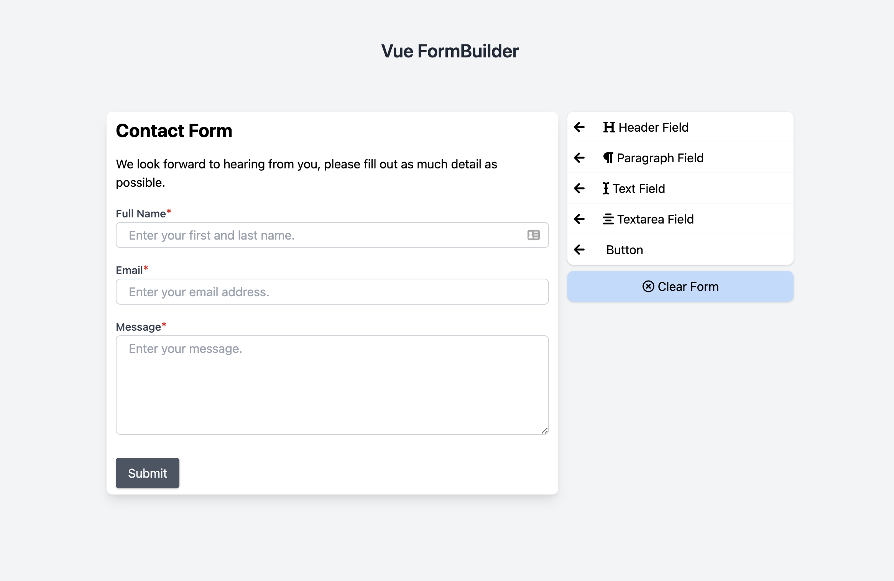
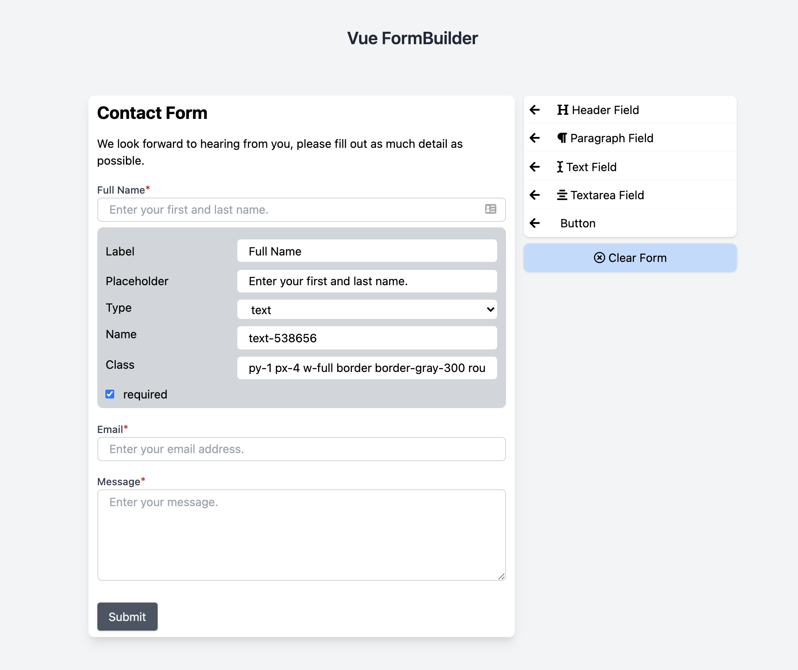

#Laravel 7.0, TailwindCss and Vue Form Builder

This project was inspired out of the need for a drag and drop form builder. There is a jQuery formBuilder but I couldn't find one that was built with Vue so I decided to take on the project.

This project isn't ready for production yet, still has a lot of work. But if you'd like to contribute, please do!

#ToDo
- [ ] Add more field options
- [ ] Make fields draggable

